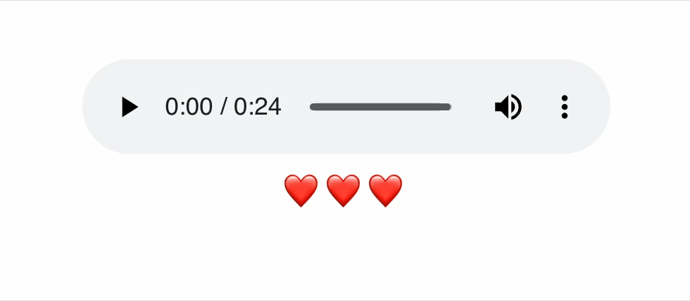

# 2주차 

## 이번 주차에 배우게 될 내용

- useState, useEffect 기초 훅 사용법 알아보기
- 조건부 렌더링 활용해보기

## 구현해볼 기능


## useState
``` js
const [state, setState] = useState(initialState)
```
``` js
import { useState } from 'react';

function MyComponent() {
  const [age, setAge] = useState(27);
  const [name, setName] = useState('윤여환');
  const [todos, setTodos] = useState(() => createTodos());
  // ...
}
```
state 변수를 추가할 수 있는 React Hook

> <br/>State 변수? <br/>**마지막 값을 기억**하는 로컬 변수<br/><br/>

### 규칙
배열 구조 분해를 사용하여 `[something, setSomething]`과 같은 state 변수의 이름을 지정하는 것

### 매개변수

|   |   |
|---|---|
| initialState | state의 초기 설정값 |

### set 함수
```
setName('윤여환2')
setName(prev => prev + "2") // 윤여환 
```

### 주의사항
set 함수를 호출해도 이미 실행 중인 코드의 현재 state는 변경되지 않음
``` js
function handleClick() {
  setName('윤여환2');
  console.log(name); // 아직 "윤여환"
}
```
set함수는 다음 렌더링에서 반환할 useState에만 영향을 준다

## useEffect
``` js
import { useState, useEffect } from 'react';
import { createConnection } from './chat.js';

function ChatRoom({ roomId }) {
  const [serverUrl, setServerUrl] = useState('https://localhost:1234');

  useEffect(() => {
    const connection = createConnection(serverUrl, roomId);
    connection.connect();
    return () => {
      connection.disconnect();
    };
  }, [serverUrl, roomId]);
  // ...
}
```
컴포넌트의 렌더링이 끝난 이후 후속 처리를 수행하는 React Hook

### 매개변수

```
useEffect(setup, dependencies?)
```

|   |   |
|---|---|
| setup | Effect의 로직이 포함된 함수, 설정 함수는 선택적으로 clean up 함수를 반환할 수 있고, 컴포넌트가 DOM에 추가된 이후에 설정 함수를 실행 <br/> 의존성의 변화에 따라 컴포넌트가 리렌더링이 되었을 경우, (설정 함수에 clean up 함수를 추가했었다면) 정리 함수를 실행, 컴포넌트가 DOM에서 제거된 경우에도 정리 함수를 실행 |
| dependencies *(optional)* | 설정 함수의 코드 내부에서 참조되는 모든 반응형 값들이 포함된 배열로 구성됨. 반응형 값에는 props와 state, 모든 변수 및 컴포넌트 body에 직접적으로 선언된 함수들이 포함됨.<br/>의존성 배열은 `[dep1, dep2, dep3]`과 같이 작성되어야함<br/>의존성을 생략할 경우, Effect는 컴포넌트가 리렌더링될 때마다 실행 |

> <br /> **‼ 중요** <br/>Effect는 (채팅 시스템과 같은) 외부 시스템과 컴포넌트가 동기화를 유지할 수 있도록 한다. 외부 시스템은 React에 의해 컨트롤되지 않는 모든 코드를 의미함. <br/><br/>예를 들어:<br /> <br /> `setInterval()`에 의해 관리되는 타이머 또는 `clearInterval()`.
`window.addEventListener()`을 이용한 이벤트 구독 또는 `window.removeEventListener()`.
`animation.start()`와 같은 서드 파티 애니메이션 라이브러리 API 또는 `animation.reset()`.
만약 외부 시스템과 React를 연결할 필요가 없다면 Effect를 사용할 필요가 없을 수 있다<br/><br/>

## 실습하기


### 요구사항
- 재생 중에는 오디오 플레이어를 조작할 수 없다
- 최대 3회까지 재생가능하다
  - 3번 이상 재생하면 더이상 재생할 수 없다
- 지금까지 몇 번의 기회가 남아있는지 알 수 있는 상태창이 필요하다
  - 남은 기회는 ❤️ → `<FilledHeart />` 활용
  - 소진한 기회는 🩶로 표시한다 → `<EmptyHeart />` 활용
- audio element의 `play`, `ended` 이벤트를 필수로 활용해야한다
- 재생 상태를 알 수 있는 state 변수를 선언해야한다
- 현재 남은 기회를 알 수 있는 state 변수를 선언해야한다


### 수정해야하는 파일
- `src/components/AudioPlayer.tsx`

### 활용하면 좋은 것
- `src/components/AudioPlayer.tsx` 파일 내부에 `disabledStyle` 변수를 audio태그 style에 넣어주면 audio를 간단하게 조작 불가능하도록 만들 수 있음