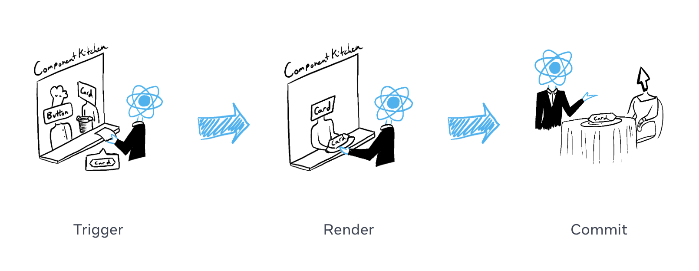
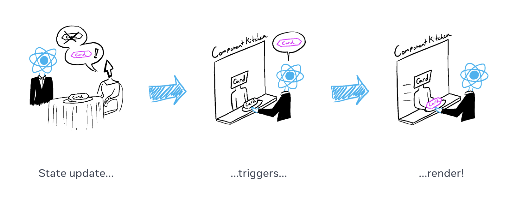

# 3주차 

## 이번 주차에 배우게 될 내용
- 조건부 렌더링 활용해보기
- 2주차 실습코드 완성하기
- props 다뤄보기

### 조건부 렌더링 활용해보기

``` jsx
if (isPacked) {
  return <li className="item">{name} ✅</li>;
}
return <li className="item">{name}</li>;
```
조건부로 if 문과 함께 JSX식(마크업)을 반환가능

<br/><br/>


``` jsx
if (isPacked) {
  return null;
}
return <li className="item">{name}</li>;
```
조건부로 null을 사용하여 아무것도 반환하지 않기 

<br/><br/>

``` jsx
const nameWrapper = <span>{name} ✅</span>

return <li className="item">{nameWrapper}</li>;
```
일부 JSX를 변수에 저장한 다음 중괄호를 사용하여 다른 JSX에 포함가능

<br/><br/>

``` jsx
return <li className="item">{cond ? <A /> : <B />}</li>
```
JSX에서 `{cond ? <A /> : <B />}`는 cond이면 `<A />`를 렌더링하고, 그렇지 않으면 `<B />`를 렌더링

<br/><br/>

``` jsx
return <li className="item">{cond && <A />}</li>
```
JSX에서 `{cond && <A />}`는 cond이면, `<A />`를 렌더링하되, 그렇지 않으면 아무것도 렌더링하지 않음

<br/><br/>

### 렌더링과 리렌더링


*렌더링의 과정, card 컴포넌트 렌더링*

1. 렌더링 트리거 (손님의 주문을 주방으로 전달)
2. 컴포넌트 렌더링 (주방에서 주문 준비하기)
3. DOM에 커밋 (테이블에 주문한 요리 내놓기)


*리렌더링의 과정, 원하는 card 컴포넌트가 아니라 교체를 원하는 경우*
코드로 비교해보면 과정이 많이 간소화된 것을 확인할 수 있음
``` jsx
// javascript
const el = document.createElement('div');
el.setAttribute('class', 'pink-card');
el.textContent = 'Hello';
parent.appendChild(el);

// react
return <div className="pink-card">Hello</div>
```

### 컴포넌트에 props 선언해보기
``` jsx
function Avatar() {
  return (
    
  );
}

export default function Profile() {
  return (
    <Avatar />
  );
}
```

자식 컴포넌트에 props 전달하기 
``` diff
export default function Profile() {
  return (
    <Avatar
+      size={100}
    />
  );
}
```

자식 컴포넌트 내부에서 props 읽기
``` diff
- function Avatar() {
+ function Avatar({ size }: { size: number; }) {
  // person과 size는 이곳에서 사용가능
}
```

prop의 기본값 지정하기
``` jsx
function Avatar({ person, size = 100 }) {
}
```

자식을 JSX 형태로 전달하기
``` jsx
function Avatar({ children }: { children: React.ReactNode; }) {
  return (
    <div>
      
      {children} // <caption>Powered by imgur</caption>
    </div>
  )
}

export default function Profile() {
  return (
    <Avatar>
      <caption>Powered by imgur</caption>
    </Avatar>
  );
}
```