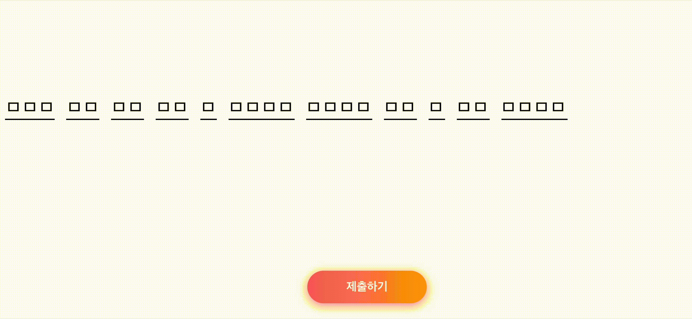

# 4주차

## 이번 주차에 배우게 될 내용

- props 다뤄보기
- 리스트 렌더링

### 컴포넌트에 props 선언해보기

```jsx
function Avatar() {
  return (
    
  );
}

export default function Profile() {
  return <Avatar />;
}
```

자식 컴포넌트에 props 전달하기

```diff
export default function Profile() {
  return (
    <Avatar
+      size={100}
    />
  );
}
```

자식 컴포넌트 내부에서 props 읽기

```diff
- function Avatar() {
+ function Avatar({ size }: { size: number; }) {
  // person과 size는 이곳에서 사용가능
}
```

prop의 기본값 지정하기

```jsx
function Avatar({ person, size = 100 }) {}
```

자식을 JSX 형태로 전달하기

```jsx
function Avatar({ children }: { children: React.ReactNode }) {
  return (
    <div>
      
      {children} // <caption>Powered by imgur</caption>
    </div>
  );
}

export default function Profile() {
  return (
    <Avatar>
      <caption>Powered by imgur</caption>
    </Avatar>
  );
}
```

# 리스트 렌더링

```jsx
array.map((element, index) => <div />); // 중괄호가 없으면 즉시 컴포넌트 반환

array.map(() => {
  return <div />;
}); // 중괄호가 있으면 return 구문 명시
```

```jsx
return (
  <ol>
    {
      [1, 2, 3].map((x, i) => <li>{x}</li>)
    }
    // <li>1</li>
    // <li>2</li>
    // <li>3</li>
  <ol>
)
```

## 구현해볼 기능



- 가사 입력 폼 만들어보기
- 답안 제출, 점수 채점 기능 구현하기
- 다시하기 기능 구현하기

## 실습하기

### 요구사항

- LyricsInput (입력창)
  - 정답을 제출하고 난 뒤에는 `<textarea />`를 조작할 수 없다
  - 가사의 길이만큼 밑줄이 나와야한다
  - 한 글자당 하나의 밑줄 컴포넌트를 가진다
  - 밑줄은 평소, 공백, 정답, 오답에 따라 각각 다른 모습을 가진다
- SubmitButton (제출버튼)
  - 제출 상태에 따라 `제출하기` 버튼 또는 `다시하기` 버튼이 보여야한다
- Score (점수판)
  - 점수는 `맞춘 개수`/`가사의 길이` 형태로 보여진다
  - `가사의 길이`는 공백 문자를 제외한 길이를 보여줘야하고
  - `맞춘 개수`도 마찬가지로 공백 문제를 제외한 일치하는 문자 개수를 보여줘야한다

### 수정해야하는 파일

- `src/components/LyricsInput.tsx`
- `src/components/Score.tsx`
- `src/components/SubmitButton.tsx`

`\*.answer.tsx` 컴포넌트에 정답이 적혀있습니다. 우선 스스로 구현을 시도해보고 도움을 얻고 싶다면 해당 컴포넌트를 확인해보세요
